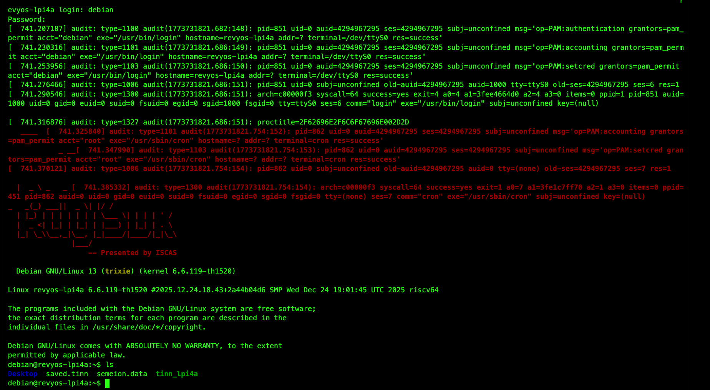

# RevyOS LPi4A Test Report

## Test Environment

### System Information

- System Version: RevyOS 20251226
- Download Link: [Nginx Directory](https://fast-mirror.isrc.ac.cn/revyos/extra/images/lpi4a/20251226/)
- Reference Installation Document: [Visit here](https://revyos.github.io/docs/)

### Hardware Information

- Lichee Pi 4A (16GB RAM + 128GB eMMC)
- USB-C Power Adapter / DC Power Supply
- USB-UART Debugger

## Installation Steps

### Download and decompress image

Download the image, use `zstd` to decompress the image:

```shell
wget https://fast-mirror.isrc.ac.cn/revyos/extra/images/lpi4a/20251226/u-boot-with-spl-lpi4a-16g.bin
wget https://fast-mirror.isrc.ac.cn/revyos/extra/images/lpi4a/20251226/boot-lpi4a-20251225_175338.ext4.zst
wget https://fast-mirror.isrc.ac.cn/revyos/extra/images/lpi4a/20251226/root-lpi4a-20251225_175338.ext4.zst
zstd -d boot-lpi4a-20251225_175338.ext4.zst
zstd -d root-lpi4a-20251225_175338.ext4.zst
```

### Flash to onboard eMMC via `fastboot`

#### Use boot button to enter fastboot mode

Hold the **BOOT** button, then connect the USB-C cable (to your PC on the other side) to enter USB burning mode.

Use the following commands to flash the image.

```shell
sudo fastboot devices
sudo fastboot flash ram u-boot-with-spl-lpi4a-16g.bin
sudo fastboot reboot
sudo fastboot flash uboot u-boot-with-spl-lpi4a-16g.bin
sudo fastboot flash boot boot-lpi4a-20251225_175338.ext4
sudo fastboot flash root root-lpi4a-20251225_175338.ext4
```

### Logging into the System

Logging into the system via serial console or graphical interface.

Default username: `debian`
Default password: `debian`

## Expected Results

The system boots up successfully and can be accessed via the serial console.

## Actual Results

The system boots up successfully and login via the serial console is successful.

### Boot Log

Screen recording (from flashing image to logging into system):

[](https://asciinema.org/a/860091)



```log
   ____              _ ____  ____  _  __
  |  _ \ _   _ _   _(_) ___||  _ \| |/ /
  | |_) | | | | | | | \___ \| | | | ' /
  |  _ <| |_| | |_| | |___) | |_| | . \
  |_| \_\\__,_|\__, |_|____/|____/|_|\_\
               |___/
                   -- Presented by ISCAS

  Debian GNU/Linux trixie/sid (kernel 6.6.119-th1520)

Linux revyos-lpi4a 6.6.119-th1520 #2025.12.24.18.43+2a44b04d6 SMP Wed Dec 24 19:01:45 UTC 2025 riscv64

The programs included with the Debian GNU/Linux system are free software;
the exact distribution terms for each program are described in the
individual files in /usr/share/doc/*/copyright.

Debian GNU/Linux comes with ABSOLUTELY NO WARRANTY, to the extent
permitted by applicable law.

```

## Test Criteria

Successful: The actual result matches the expected result.

Failed: The actual result does not match the expected result.

## Test Conclusion

Test successful.
